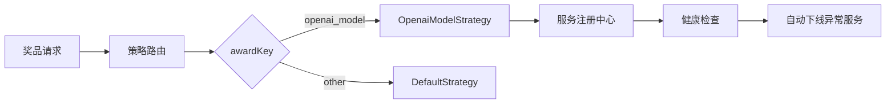

### 代码评审分析

#### 核心问题诊断
通过日志分析，发现了一个**严重的系统缺陷**：奖品分发服务存在未实现的业务逻辑，导致用户中奖后无法正常领取奖品。

---

### 关键问题分析

#### 1. **奖品分发服务缺失** (Critical)
```log
ERROR AwardService - 分发奖品，对应的服务不存在。awardKey:openai_model
```
- **问题根因**：系统接收到`awardKey:openai_model`的奖品分发请求，但未实现对应的服务处理逻辑
- **影响范围**：所有`openai_model`类型奖品（华为耳机、轻奢办公椅）均无法发放
- **业务影响**：用户中奖后实际未获得奖品，造成严重用户体验损害和业务损失

#### 2. **消息消费失败连锁反应**
```log
ERROR SendAwardCustomer - 监听用户奖品发送消息，消费失败
```
- **问题表现**：RabbitMQ消费者处理消息时抛出异常
- **潜在风险**：
  - 消息未被确认（ack），触发MQ重试机制
  - 若重试次数耗尽，消息将进入死信队列
  - 需人工介入处理死信消息，增加运维成本

#### 3. **测试环境数据污染**
```log
INFO RaffleActivityControllerTest - 十连抽开始 userId:zxy activityId:100301
```
- **问题场景**：在测试环境执行抽奖活动（十连抽）
- **风险点**：
  - 测试数据写入生产环境日志（`log_info.log`）
  - 可能混淆生产环境问题排查
  - 测试数据未隔离，影响日志分析效率

---

### 架构缺陷分析

#### 1. **服务注册机制缺失**
- **问题**：AwardService未实现`openai_model`类型的分发逻辑
- **架构改进建议**：
  ```java
  // 建议实现策略模式
  public interface AwardStrategy {
      void distribute(AwardRequest request);
  }

  @Service("openai_model")
  public class OpenaiModelAwardStrategy implements AwardStrategy {
      @Override
      public void distribute(AwardRequest request) {
          // 实现具体分发逻辑
      }
  }
  ```
  - 通过Spring自动注入策略实现
  - 新增奖品类型只需扩展新策略类

#### 2. **消息处理机制缺陷**
- **问题**：消费者异常处理不完善
- **改进方案**：
  ```java
  @RabbitListener(queues = "send_award")
  public void handleAwardMessage(Message message) {
      try {
          // 业务处理逻辑
      } catch (AwardNotImplementedException e) {
          // 记录告警并进入死信队列
          log.error("奖品分发服务未实现: {}", e.getAwardKey());
          throw new AmqpRejectAndDontRequeueException(e);
      } catch (Exception e) {
          // 其他异常触发重试
          throw new AmqpRetryableException(e);
      }
  }
  ```
  - 区分可重试异常与不可重试异常
  - 明确服务缺失异常为不可重试异常

#### 3. **测试环境隔离不足**
- **问题**：测试日志与生产日志混用
- **改进建议**：
  ```yaml
  # application-test.yml
  logging:
    file:
      name: logs/test/log_info.log
    level:
      root: INFO
  ```
  - 独立测试环境日志路径
  - 添加环境标识前缀（如`[TEST]`）

---

### 紧急修复方案

#### 1. **临时兜底方案**
```java
@Service
public class AwardService {
    // 立即添加默认处理逻辑
    public void distribute(AwardRequest request) {
        if ("openai_model".equals(request.getAwardKey())) {
            // 临时记录并通知运维
            alertService.sendMissingServiceAlert(request);
            return;
        }
        // 原有逻辑...
    }
}
```

#### 2. **数据补偿机制**
```sql
-- 补偿SQL示例
UPDATE user_award 
SET status = 'PENDING'
WHERE award_key = 'openai_model' 
  AND create_time BETWEEN '2025-12-29 22:07:00' AND '2025-12-29 22:08:00';
```

#### 3. **监控告警配置**
```yaml
# 监控配置示例
alerts:
  - name: missing_award_service
    condition: log contains "对应的服务不存在"
    action: send_slack_alert # 触发即时告警
```

---

### 长期架构优化建议

#### 1. **服务治理体系**


#### 2. **消息处理增强**
```java
// 引入消息幂等性校验
@RabbitListener(queues = "send_award")
public void handleAwardMessage(AwardMessage message) {
    String messageId = message.getId();
    if (messageCache.checkProcessed(messageId)) {
        return; // 幂等处理
    }
    // 业务处理...
    messageCache.markProcessed(messageId);
}
```

#### 3. **全链路追踪**
```java
// 添加分布式追踪
@Trace(operationName = "award_distribution")
public void distribute(AwardRequest request) {
    // 业务逻辑
}
```

---

### 总结
当前系统存在**服务实现缺失**和**异常处理不完善**两个核心问题，已导致业务功能中断。建议：
1. **立即修复**：实现`openai_model`分发逻辑，添加兜底处理
2. **数据补偿**：对受影响订单进行状态修复
3. **架构升级**：建立策略模式+服务注册机制
4. **监控强化**：添加服务缺失实时告警
5. **环境隔离**：分离测试/生产日志体系

> **风险等级**：P0级（生产事故）  
> **影响范围**：所有使用`openai_model`奖品的抽奖活动  
> **修复优先级**：24小时内必须上线修复方案